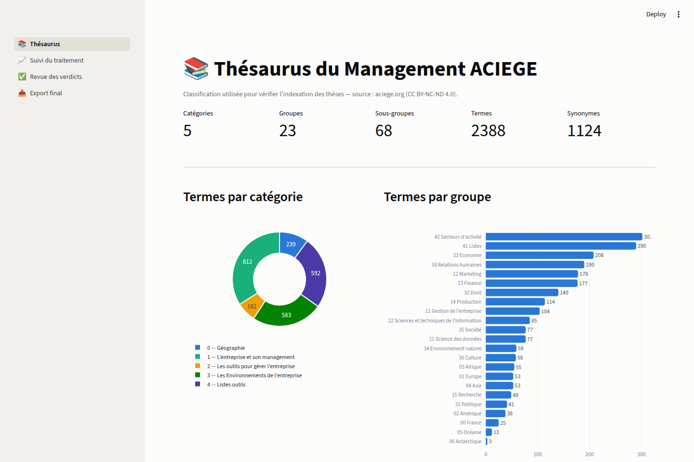
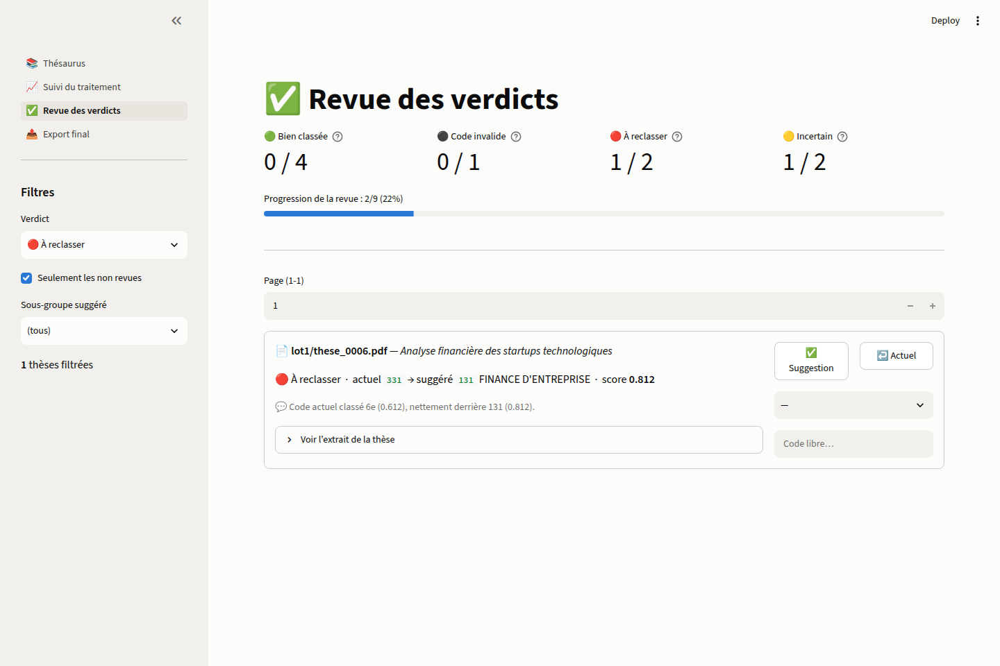
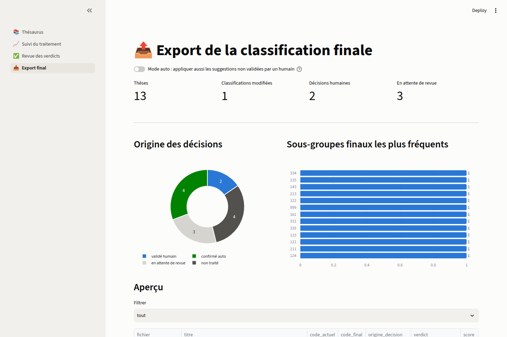

# scrap-teso — Thésaurus du Management ACIEGE

Extraction, structuration et exploitation du **Thésaurus du Management de
l'ACIEGE** (<https://aciege.org/Schema_Fra.html>) pour l'annotation d'un corpus
documentaire (~50 000 thèses).

## Le pipeline en un coup d'œil

```
aciege.org ──[1. scrape_aciege.py]──> data/ ──[2. build_thesaurus.py]──> thesaurus/
 (site web)                        (données brutes)                  (classification prête
                                                                      pour l'annotation)
```

| Étape | Script | Entrée | Sortie |
|---|---|---|---|
| 1a. Scraping schémas | `scrape_aciege.py` | index + pages `Schm/` | `data/` : hiérarchie, termes, définitions |
| 1b. Scraping listes | `scrape_listes.py` | pages `CS/` (microthésaurus) | `data/` : relations TG/TS + synonymes « Employé Pour » |
| 2. Structuration | `build_thesaurus.py` | `data/*.json` | `thesaurus/` (CSV pivot, JSON, SKOS) |
| 3. Vérification corpus | `pipeline/` (PG + MinIO + Airflow) | `thesaurus/` + PDF des thèses | verdicts bien classé / à reclasser + revue |

Pour l'étape 3, voir **`pipeline/README.md`** (démarrage Docker) et
**`BESOINS.md`** (clé Hugging Face, format du manifeste, prérequis).

## Aperçu de l'interface

| Thésaurus | Suivi du traitement |
|---|---|
|  |  |

| Revue des verdicts | Export final |
|---|---|
|  |  |

## Installation

```bash
pip install -r requirements.txt
```

---

## 1. `scrape_aciege.py` — scraping du thésaurus

Récupère l'intégralité du thésaurus en deux passes :

1. **La page index** `Schema_Fra.html` : la hiérarchie catégorie → groupe →
   sous-groupe est portée par les classes CSS `ThCol1Fra` / `ThCol2Fra` /
   `ThCol3Fra`, avec pour chaque sous-groupe ses liens « Schéma » et « Liste ».
2. **Les pages schéma** `Schm/Fra/FRA_xxx.html` : chaque terme est une zone
   cliquable `<area>` dont l'attribut `title` contient le nom, la définition
   et la ou les sources — pas besoin de visiter les pages de détail `Dct/`.

```bash
python scrape_aciege.py --limit 3   # test rapide (3 schémas)
python scrape_aciege.py             # tout le thésaurus (~2 min)
```

Sorties dans `data/` :

- `table1_index.csv` — 1 ligne par sous-groupe : catégorie ; thème ; groupe ;
  sous-groupe ; liens Schéma/Liste.
- `table2_termes.csv` — 1 ligne par terme : sous-groupe ; liens ; code ;
  titre ; définition ; source.
- `aciege.xlsx` — les 2 tableaux en 2 feuilles Excel.
- `aciege.json` — tout, plus les erreurs éventuelles.

Les CSV utilisent `;` et l'UTF-8 BOM : ils s'ouvrent directement dans Excel FR.

### Exécution automatisée (GitHub Actions)

Le workflow **`.github/workflows/scrape.yml`** exécute l'ensemble
scrape → structuration sur un runner GitHub et committe `data/` et
`thesaurus/` sur la branche. Il se déclenche à chaque push sur la branche
de travail (hors données et docs) ou manuellement (*workflow_dispatch*).
Le tout peut aussi se lancer en local avec les commandes ci-dessus.

---

## 2. `build_thesaurus.py` — structuration en thésaurus

Transforme les données brutes en classification propre à 4 niveaux :

```
5 catégories > 23 groupes > 68 sous-groupes > 2 388 termes   (2 484 concepts)
```

Les termes viennent des schémas (1 858, avec définitions) **et** des listes
(530 de plus : langues, géographie, organisations… sous-groupes sans schéma).
Les pages Liste apportent aussi, par terme : les **synonymes** («&nbsp;Employé
Pour&nbsp;» → `skos:altLabel`, ex. VRP → AGENT COMMERCIAL) et la **hiérarchie
fine entre termes** (Terme Générique / Termes Spécifiques → `skos:broader`/
`skos:narrower`).

```bash
python build_thesaurus.py           # data/aciege.json -> thesaurus/
```

Sorties dans `thesaurus/` :

| Fichier | Usage |
|---|---|
| `concepts_flat.csv` | **Format pivot** : 1 concept par ligne avec `id`, `parent_id`, `niveau`, `code`, `libelle`, chemins complets (codes et libellés), définition, source, URL. À charger dans pandas ou un outil d'annotation. |
| `thesaurus.json` | Hiérarchie imbriquée (catégories > groupes > sous-groupes > termes) pour usage programmatique. |
| `thesaurus.skos.ttl` | Export **SKOS** (Turtle), le standard des thésaurus documentaires : importable dans VocBench, TemaTres et la plupart des plateformes d'indexation. |
| `stats.md` | Statistiques de couverture. |

---

## 3. Annoter un corpus avec cette classification

- **Étiquette = le `code`** : `111` (sous-groupe ORGANISATION) ou `111_48`
  (terme ANALYSE DES SYSTEMES). La hiérarchie se retrouve par préfixe
  (`111_48` ⊂ `111` ⊂ `11` ⊂ `1`), donc les statistiques s'agrègent à
  n'importe quel niveau après coup.
- **Granularité** : le niveau **sous-groupe (68 classes)** est le bon pivot
  pour classer un gros corpus ; le niveau **terme (1 858)** sert à
  l'indexation fine.
- **Multi-label** : une thèse chevauche souvent 2-3 sous-groupes — prévoir un
  code principal + des codes secondaires.
- **Les définitions sont les critères d'annotation** : consignes pour les
  annotateurs humains, ou base d'une pré-annotation automatique (matching
  embeddings / LLM entre résumé de thèse et définitions du thésaurus).

## État des données (scrape du 2026-07-09)

- 68 sous-groupes (53 avec schéma, tous avec liste), **0 erreur** de scraping.
- 2 388 termes : 1 858 depuis les schémas (avec définitions) + 530 depuis les
  listes seules (langues, géographie, organisations…).
- 661 termes ont des synonymes (1 124 synonymes « Employé Pour » au total) ;
  la quasi-totalité ont un terme générique (hiérarchie fine).
- 871 termes sans définition (principalement ceux issus des listes) ; leurs
  pages `Dct/` pourraient les fournir — passe complémentaire possible.
- Voir `thesaurus/stats.md` pour le détail à jour.

## Fichiers annexes

- `scraper.py` — miroir générique récursif (HTML + ressources + tableaux),
  indépendant du thésaurus ; utile pour archiver n'importe quel site.
  `python scraper.py <url> -o mirror --depth 3`
- `.github/workflows/scrape.yml` — le workflow GitHub Actions décrit plus haut.

## Licence des données

Le Thésaurus du Management de l'ACIEGE est diffusé sous licence
**Creative Commons BY-NC-ND 4.0** (Attribution, Pas d'Utilisation Commerciale,
Pas de Modification). Les données extraites ici en héritent : citez l'ACIEGE
et respectez ces conditions.
