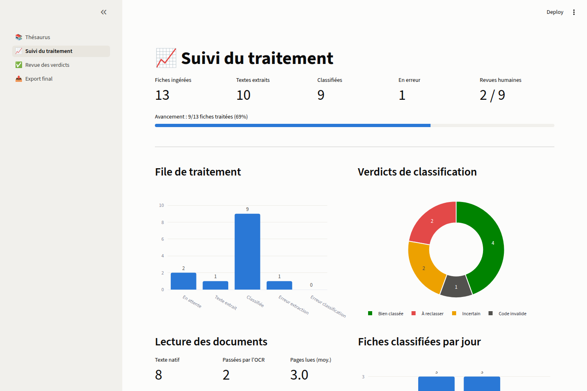

# Pipeline de vérification de classification (PG + MinIO + Airflow)

Vérifie la classification ACIEGE de ~10 000 thèses PDF : lecture progressive
des premières pages (OCR si scan), comparaison au thésaurus, verdict
« bien classé / à reclasser / incertain », rapport et interface de revue.

## Architecture

```
                 ┌─────────────┐
 PDF + manifeste │    MinIO    │  buckets: theses, rapports
 ──────────────► │  (stockage) │ ◄─────────── rapport CSV
                 └──────┬──────┘
                        │
                 ┌──────▼──────┐    ┌──────────────┐
                 │   Airflow   │───►│  PostgreSQL  │  theses, resultats
                 │  (DAG 4     │    └──────┬───────┘
                 │   étapes)   │           │
                 └─────────────┘    ┌──────▼───────┐
                  embeddings +      │  Streamlit   │  revue humaine
                  LLM HuggingFace   │  (port 8501) │
                                    └──────────────┘
```

DAG `aciege_verification_theses` :
1. **enregistrer_manifeste** — lit `manifest.csv` du bucket, upsert en base.
2. **extraire_textes** — lit chaque PDF page à page (max `MAX_PAGES`=5),
   s'arrête dès que le texte est « informatif » (longueur + indices
   résumé/mots-clés/introduction) ; OCR Tesseract fra+eng si page scannée.
3. **classifier** — embeddings (`EMBED_MODEL`) du texte vs cartes des 2 388
   termes du thésaurus (libellé + synonymes + définition), agrégation par
   sous-groupe ; verdict par règles de marge ; les cas incertains sont
   arbitrés par le LLM (`LLM_MODEL`) via l'Inference API Hugging Face.
4. **rapport** — exporte le CSV final dans le bucket `rapports`.

## Démarrage

```bash
cd pipeline
cp .env.example .env        # renseigner HF_TOKEN et les mots de passe
docker compose up -d --build
```

| Service | URL | Identifiants |
|---|---|---|
| Airflow | http://localhost:8080 | `docker compose logs airflow \| grep -i password` |
| Console MinIO | http://localhost:9001 | `MINIO_ROOT_USER` / `MINIO_ROOT_PASSWORD` |
| **Interface** (3 pages) | http://localhost:8501 | — |
| PostgreSQL | localhost:5432 | `POSTGRES_USER` / `POSTGRES_PASSWORD` |

L'interface (Streamlit) comporte quatre pages
(captures dans [`../docs/captures/`](../docs/captures/)) :



- **📚 Thésaurus** — la classification présentée proprement : tuiles
  (catégories/groupes/sous-groupes/termes/synonymes), donut des termes par
  catégorie, barres par groupe, sunburst de la hiérarchie complète,
  couverture définitions/synonymes, et un explorateur avec recherche
  (libellé, synonyme, définition).
- **📈 Suivi du traitement** — fiches ingérées, textes extraits, classifiées,
  erreurs, barre d'avancement, file de traitement, donut des verdicts,
  usage OCR, débit par jour, dernières erreurs.
- **✅ Revue des verdicts** — validation humaine : filtres (verdict, score,
  sous-groupe suggéré), pagination, boutons accepter/garder, choix parmi les
  candidats ou code libre, barre de progression de la revue.
- **📤 Export final** — classification consolidée (décisions humaines >
  verdicts auto), mode prudent ou auto, graphiques d'origine des décisions,
  et téléchargement du CSV final.

## Charger les 10 000 thèses

```bash
# 1. Les PDF
docker compose exec -T minio sh -c 'mc alias set local http://localhost:9000 $MINIO_ROOT_USER $MINIO_ROOT_PASSWORD'
# ou depuis votre machine avec le client mc :
mc alias set local http://localhost:9000 minio <mot-de-passe>
mc cp --recursive /chemin/vers/mes/theses/ local/theses/

# 2. Le manifeste (voir format dans ../BESOINS.md)
mc cp manifest.csv local/theses/manifest.csv
```

Puis dans Airflow : déclencher `aciege_verification_theses`. Le DAG est
**rejouable** : chaque exécution ne traite que les thèses non encore passées
(`BATCH_SIZE`=1000 par run — relancer jusqu'à épuisement, ou augmenter).

## Résultats

- **Rapport CSV** : bucket `rapports` (une ligne par thèse : code actuel,
  code suggéré, score, verdict, justification).
- **Revue humaine** : http://localhost:8501 — filtrer par verdict, valider la
  suggestion / garder l'actuel / saisir un autre code ; les décisions vont
  dans `resultats.decision_humaine`.
- **SQL direct** : tables `theses` et `resultats` dans PostgreSQL.

## Dimensionnement

- Embeddings : ~10 000 thèses × quelques pages = ~30-60 min sur CPU,
  quelques minutes sur GPU. Le modèle est téléchargé au premier run
  (cache dans le volume `hf-cache`).
- L'arbitrage LLM ne s'applique qu'aux cas « incertains » (typiquement
  10-20 % du corpus) via l'API HF — pas de GPU local requis.
